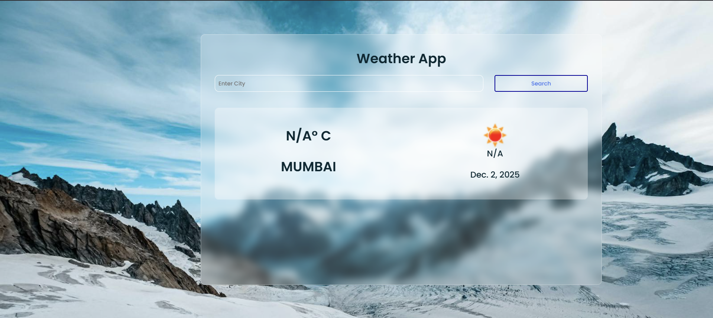

# Simple Weather App Using Django

## Here I've created a simple weather app using Django.This project is fully based on python and django. I've used some external APIs to get the weather data and city image. Also to retrive my some of the queries I've used AI Chatbot. So this is a full stack project.

## Features
- Get weather data for any city using OpenWeatherMap API
- Get city image using Google Custom Search API
- Get current date and time
